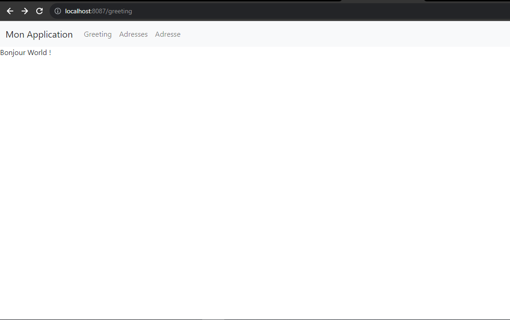
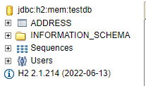
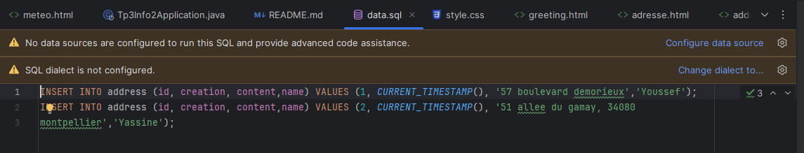
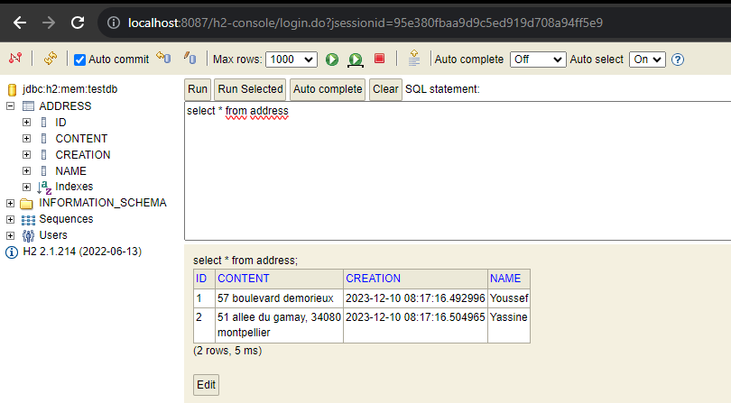
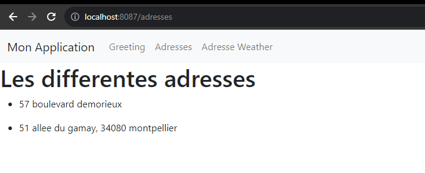
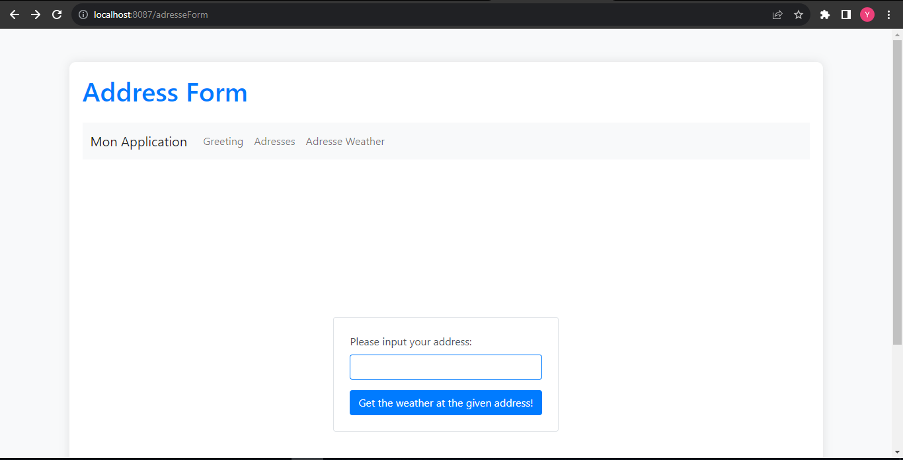
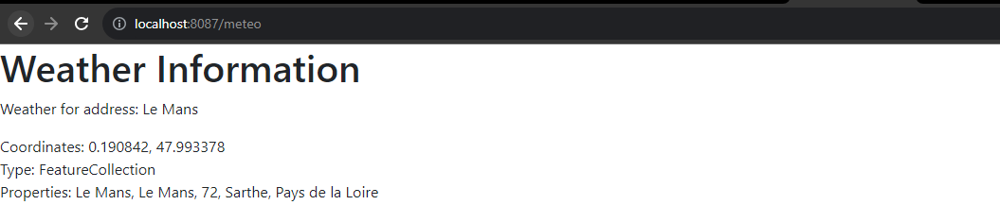

# Projet Spring Boot 

une fois le programme est chargé, Saisir cet Url dans le navigateur:
```
http://localhost:8087/adresseForm
```
Lien Github :
```
https://github.com/YouAr742/TP_SpringMeteo
```
# TP3
## Dépendances

### 1. Spring Web (Web)

**Description :** Spring Web fournit un support pour le développement d'applications web basées sur le framework Spring. Il facilite la gestion des requêtes HTTP, des routes et offre des fonctionnalités pour la création d'API REST.

**Utilisation :** Utilisé pour développer des applications web avec Spring, gérer les requêtes HTTP et configurer des contrôleurs.

### 2. Java Persistence API (JPA)

**Description :** JPA (Java Persistence API) est une spécification Java qui permet de gérer les données dans les applications Java EE et Java SE. Elle fournit une interface pour le mapping objet-relationnel (ORM) dans le contexte de bases de données relationnelles.

**Utilisation :** Intégré dans Spring Data JPA pour simplifier l'accès et la gestion des données dans une base de données relationnelle.

### 3. Hibernate

**Description :** Hibernate est un framework de persistance open-source qui implémente la spécification JPA. Il facilite le mapping objet-relationnel et la gestion des opérations de base de données.

**Utilisation :** Utilisé avec JPA pour la persistance des objets Java dans une base de données relationnelle.

### 4. H2 Database (H2)

**Description :** H2 est une base de données relationnelle écrite en Java. Elle est légère, rapide et peut être intégrée dans des applications Java.

**Utilisation :** Utilisé souvent comme base de données intégrée pour le développement et les tests, en particulier dans le contexte de projets Spring Boot.

### 5. Spring Boot DevTools (DevTools)

**Description :** Spring Boot DevTools offre des fonctionnalités de développement telles que le redémarrage automatique de l'application, la configuration automatique et d'autres outils facilitant le processus de développement.

**Utilisation :** Facilite le développement en permettant le redémarrage automatique de l'application lors de modifications, entre autres fonctionnalités utiles.

### 6. Thymeleaf

**Description :** Thymeleaf est un moteur de templates pour Java qui permet d'intégrer facilement des pages HTML dans les applications Spring.

**Utilisation :** Utilisé pour la création de vues HTML dans les applications web Spring, avec une syntaxe basée sur les attributs pour simplifier l'intégration des données dynamiques.

## Comment lancer l'application

Pour lancer l'application Spring Boot, vous pouvez utiliser la commande Maven suivante :

```
mvn spring-boot:run
```
ou bien par l'icon en haut.

En regardant ce qui est écrit: on trouver que tous est OK

##### http://localhost:8087
On obntient un page blanche sans aucun erreur.

## Etape 13 - Questions et Réponses

1. **Avec quelle partie du code avons-nous paramétré l'url d'appel `/greeting` ?**
  ``` 
    @RequestParam(name = "nameGET", required = false, defaultValue = "World")
   ```
2. **Avec quelle partie du code avons-nous choisi le fichier HTML à afficher ?**
   Le choix du fichier HTML à afficher est déterminé par la valeur retournée par la méthode `greeting`, qui est "greeting". Cela correspond au nom du fichier HTML dans le dossier "templates" sans l'extension (dans notre cas, "greeting.html").
  ``` 
    return "greeting"
  ``` 

3. **Comment envoyons-nous le nom à qui nous disons bonjour avec le second lien ?**
   Le nom à qui nous disons bonjour est envoyé comme un paramètre de requête dans l'URL. Dans l'URL [http://localhost:8080/greeting?name=ENSIM](http://localhost:8080/greeting?name=ENSIM), "ENSIM" est le nom qui est extrait à l'aide de `@RequestParam(name="nameGET", required=false, defaultValue="World")` dans la méthode `greeting`. Ce nom est ensuite ajouté au modèle avec `model.addAttribute("nomTemplate", nameGET)`. Dans le fichier HTML, le nom est affiché avec Thymeleaf grâce à `th:text="'Bonjour ' + ${nomTemplate} + ' !'"`.

### En faisant [http://localhost:8080/greeting]


## Etape 17

Relancez votre application, retournez sur la console de H2 : [http://localhost:8080/h2-console](http://localhost:8080/h2-console). Avez-vous remarqué une différence ?

**Réponse Etape 17:**
Lorsque on retourne sur la console de H2, on trouve une nouvelle table qui correspond à la classe `Address` que nous avons ajoutés dans le modèle. Cette table a été créée automatiquement grâce à l'utilisation de Hibernate et de la fonctionnalité d'autogénération de schéma.



## Etape 18

Expliquez l'apparition de la nouvelle table en vous aidant de vos cours sur Hibernate et de la dépendance Hibernate de Spring. Ajoutez la réponse dans le README.

**Réponse Etape 18:**
L'apparition de la nouvelle table est due à l'utilisation de Hibernate, qui est un framework de persistance pour Java, intégré dans Spring. Hibernate simplifie le mapping objet-relationnel en créant automatiquement les tables de base de données correspondantes aux entités définies dans notre code Java. La classe `Address` est annotée avec `@Entity`, ce qui indique à Hibernate qu'elle doit être persistée dans la base de données. La combinaison de l'annotation `@Entity`, l'annotation `@Id` indiquant la clé primaire, et l'annotation `@GeneratedValue` indiquant que la clé primaire doit être générée automatiquement, permet à Hibernate de créer la table correspondante dans la base de données.

## Etape 19

Créez un fichier "data.sql" à côté du fichier "application.properties" et ajoutez-y le contenu suivant :

```sql
INSERT INTO address (id, creation, content) VALUES (1, CURRENT_TIMESTAMP(), '57 boulevard demorieux');
INSERT INTO address (id, creation, content) VALUES (2, CURRENT_TIMESTAMP(), '51 allee du gamay, 34080 montpellier');
``` 

Voila data.sql : 



## Etape 20

Relancez l'application, retournez sur la console H2 : [http://localhost:8080/h2-console](http://localhost:8080/h2-console).

**Réponse Etape 20:**
Faites une requête de type SELECT sur la table `Address`. Voyez-vous tout le contenu de data.sql ?

**Réponse Etape 20:**
Oui, on voit le contenu de data.sql dans la table `Address` après avoir fait une requête de type SELECT dans la console H2. Les données ajoutées via le fichier data.sql ont été chargées lors du démarrage de l'application, ce qui confirme que l'initialisation de la base de données avec ces données a réussi.

Voilà le résultat obtenu



On récupere les adresses : 



## Etape 23

**Question Etape 23:**
Pouvez-vous trouver à quoi sert l'annotation `@Autowired` du code précédent sur internet ?

**Réponse Etape 23:**
L'annotation `@Autowired` est utilisée pour effectuer l'injection de dépendances automatique de Spring. Dans ce cas, l'annotation `@Autowired` est utilisée pour injecter automatiquement une instance de `AddressRepository` dans la propriété `addressRepository`. Cela permet au contrôleur d'accéder aux fonctionnalités de `AddressRepository` sans avoir à créer manuellement une instance de celle-ci. L'injection de dépendances facilite la gestion des dépendances entre les composants dans une application Spring.

## Etape 30

**Réponse Etape 30:**
Expliquez la méthode que vous avez utilisée pour ajouter Bootstrap dans le README.

1. J'ai recherché la dépendance Maven pour Bootstrap sur le site Maven Central (https://search.maven.org/).
2. J'ai ajouté la dépendance Maven de Bootstrap à mon fichier `pom.xml`.

Exemple de dépendance Maven pour Bootstrap :
```xml
<dependency>
    <groupId>org.webjars</groupId>
    <artifactId>bootstrap</artifactId>
    <version>4.3.1</version>
</dependency>
```
3. J'ai redémarré mon application Spring Boot pour que les modifications prennent effet.
4. J'ai inclus les fichiers CSS et JS de Bootstrap dans mes pages Thymeleaf en utilisant les chemins fournis par WebJars.
```xml
<link rel="stylesheet" href="/webjars/bootstrap/5.1.3/css/bootstrap.min.css"></link>
``` 
Cela m'a permis d'ajouter Bootstrap 5 à mon projet Spring Boot

# TP4 (La suite)

On fait une autre page :nouvelle page de adresse (url\adresseFrom)



##### On tape la ville et on récupére ces coordonnées grace a API Etalab (Exemple le mans) :



##### On utiliser l'API meteoConcept  

## Etape 6 - Réponses aux Questions

### Faut-il une clé API pour appeler MeteoConcept ?
Oui, pour utiliser l'API MeteoConcept, je cree un compte sur leur site (https://api.meteoconcept.com) et obtenir une clé API.
Mon Token : 62c71292da325a81472f1e1db06234438a3132a71acf91deafcb1f1998b8f08d
(Voir fichier txt : token.txt)

### Quelle URL appeler ?

```
https://api.meteo-concept.com/api/forecast/daily?token= + token +
&latlng= + latitude + , + longitude
```

### Quelle méthode HTTP utiliser ?
on utilise la méthode HTTP GET pour effectuer des appels à l'API MeteoConcept.

### Comment passer les paramètres d'appels ?

Les paramètres d'appels sont passés dans l'URL de la requête GET. Dans notre API MeteoConcept, les coordonnées géographiques (latitude et longitude) sont utilisées comme paramètres pour obtenir des informations météorologiques spécifiques à ces coordonnées. 


### Où est l'information dont j'ai besoin dans la réponse :

- **Pour afficher la température du lieu visé par les coordonnées GPS :**
  Selon la réponse JSON renvoyée par l'API MeteoConcept. je cherche le champ correspondant à la température.

- **Pour afficher la prévision de météo du lieu visé par les coordonnées GPS :**
  Selon la réponse JSON de l'API MeteoConcept pour trouver les informations de prévision. Les détails sur la prévision devraient être inclus dans la structure JSON renvoyée par l'API.

